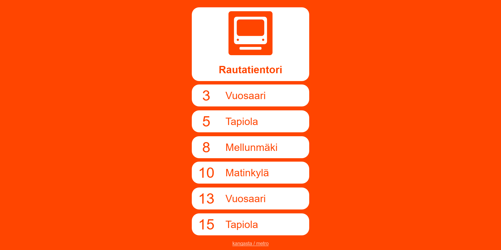

# metro

Checkout [kangasta/timetbl](https://github.com/kangasta/timetbl) for slightly different approach! 

## Usage

### What?

Simple react app to show next departures of nearest HSL metro station. See [live](https://kangasta.github.io/metro/). Allows selecting preferred mode of transportation by clicking the vehicle symbol and selecting a specific nearby stop by clicking the stop name.

### Why?

To check departures of nearby stop with as few clicks as possible and without having to type anything.

### How?

The app polls browser for location data and sends a GraphQL query to HSL API to fetch traffic info. See [digitransit](https://digitransit.fi/en/developers/) for details about the API.

### Where?

The app works as it is in the regions served by HSL. Should be somewhat easily ported or extended to support other regions using the same API.

## Preview

Screenshot of the app, with the landscape only columns disabled:

## Developing

Created based on [create-react-app](https://github.com/facebookincubator/create-react-app), see README over there for details.
